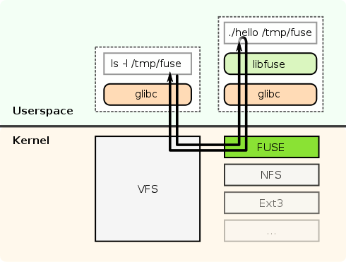

# Go, and a Simple, RAM-Based File System
**Due: September 12, 2018, 11:59:59 pm, v1.0**

This project is designed to familiarize you with two technologies: the
[Go systems programming language](https://golang.org/ref/spec) from Google, and the [FUSE](https://en.wikipedia.org/wiki/Filesystem_in_Userspace) interface
for building user-level file systems.
You will use Go and the Bazil/fuse language binding to build a simple
user-space file system (UFS) that supports arbitrary file creations,
reads, writes, directory creates, and deletions.
The UFS will not support persistence, i.e.
the contents of all UFS files will disappear the minute the UFS
process is killed.



FUSE is a loadable kernel module; that is, a piece of code that
is compiled and loaded directly into the kernel.
Inside the kernel, potentially many different file systems
co-exist, all living under the *virtual file system* layers, or
VFS for short (see Figure~1).
The VFS layer allows any application to call down into the file system
with the same API, regardless of which, or which type of file system,
is ultimately serving the file requests.
We will use the kernel module, but *will never be hacking inside
the kernel.*

The VFS layer knows which underlying file system to use based on which
part of the file system namespace is being accessed.
For instance, if you have an NFS volume mounted at /mnt/nfs, then the
VFS layer knows to vector any calls to some file
`/mnt/nfs/foo.c` to the NFS client, which will then communicate
with a (possibly remote) NFS server for the actual data.

Likewise, we will mount a FUSE volume somewhere in the file system
namespace (`/tmp/<userid>` is a good default), and any system
calls to files under that directory get vectored to the FUSE module
that lives under the VFS layer.
In turn, the FUSE module will re-direct any calls sent to it back up
to our user-level program.
So all we have to write is the user-level program!


## Setup

Ideally, you work on your own mac or linux box, as having root access
makes things easier, and your mounts will not collide with anyone
else's.
However, I will test your code first on my mac, and then on `hyperion.cs.umd.edu`
(Ubuntu) if the mac version fails. Working on `hyperion` is the ground truth,
the mac is just an optimization.
You will all have accounts on `hyperion` by Thursday 9/6, but not root access.

If you are working on your own machine, you might need to install FUSE
yourself.
This is definitely true if you are working on a Mac, where you must
install osxfuse:
[**http://osxfuse.github.io/**](http://osxfuse.github.io/).
FUSE is part of the main Linux trunk for recent kernels, and so the
kernel module is not needed for these kernels.
More info at
[sourceforge](http://fuse.sourceforge.net/).

Though it would not be too difficult, please do not attempt to get
root, or to view or alter others' files on `hyperion`.

### Installing Go 
You will need to install two pieces of
software: the Go language (often referred to as "golang", especially
in web searches), and the Go language bindings for FUSE.
The following
is a good set of docs on both Go and bazil:

- [http://golang.org](http://golang.org)
  - [language spec](http://golang.org/ref/spec)
  - [packages](http://golang.org/pkg)
  - [the tour](http://tour.golang.org)
  - [effective go article](http://golang.org/doc/effective_go.html)
  - [very good talk by Rob Pike](http://talks.golang.org/2012/splash.article)
  - [golang book](http://www.golang-book.com/)
- Bazil/fuse
  - ["fuse documentation"](http://libfuse.github.io/doxygen/)
  - [fuse function overview (for C)](https://www.cs.hmc.edu/~geoff/classes/hmc.cs135.201109/homework/fuse/fuse_doc.html#function-purposes)
  - [fuse options](http://manpages.ubuntu.com/manpages/xenial/man8/mount.fuse.8.html)
  - [MacFuse options](https://code.google.com/archive/p/macfuse/wikis/OPTIONS.wiki)
  - [Bazil](http://bazil.org/fuse/)
  - [talk](http://bazil.org/talks/2013-06-10-la-gophers/#1)

Install Go from here:
[http://golang.org/doc/install](http://golang.org/doc/install). The
current version is 1.11. Best to install directly rather than use
package installers such as `apt-get`, `macports`, or `homebrew`.

Once you've set up your directories and environment, you can install
`bazil/fuse` and `context` as:

     go get bazil.org/fuse
     go get golang.org/x/net/context
     go get github.com/mattn/go-getopt

This command will install bazil/fuse into your go path, irregardless
of your current working directory.

### Obtain the project files

You will retrieve all setup files from the class web page. Clone the gitlab repository as:

   git clone git@gitlab.cs.umd.edu:keleher/818fall18

or

   git clone http://gitlab.cs.umd.edu/keleher/818fall18

You will do repeated pulls on this repository during the remainder of the semester to grab
more content. 

`cd` into `p1` and you will see two files:
`hellofs.go` and `dfs.go`. The former is a skeleton of a dynamic
in-memory file system; the latter is a file where you will place your code. 

The `hellofs.go` code is actually runnable. From the
`p1` directory, type:

    go run hellofs.go 

and `dss` will be created in the same directory. `cd` around, `cat` the
file, etc. If this does not work,
your environment is not set up correctly.  Note that this is a
*read-only* file-system, so you can not modify anything.

## What to do

You will expand `dfs.go` into a fully functional in-memory
file system. This means that files can be copied, created, edited, and
deleted on mount points exported by your code. 
The `dfs.go` file has most of the boilerplate.
You need to create objects that implement specific
interfaces (`fs.Node` and `fs.FS`), pass those to fuse, and
then fuse can call those objects' methods to implement file system
functionality. 
You will do this through definition of the following methods, probably using less
than 100 lines of code:
```
   func (FS) Root() (n fs.Node, err error)
   func (n *DFSNode) Attr(ctx context.Context, attr *fuse.Attr) error
   func (n *DFSNode) Lookup(ctx context.Context, name string) (fs.Node, error)
   func (n *DFSNode) ReadDirAll(ctx context.Context) ([]fuse.Dirent, error)
   func (n *DFSNode) Getattr(ctx context.Context, req *fuse.GetattrRequest, resp *fuse.GetattrResponse) error
   func (n *DFSNode) Fsync(ctx context.Context, req *fuse.FsyncRequest) error
   func (n *DFSNode) Setattr(ctx context.Context, req *fuse.SetattrRequest, resp *fuse.SetattrResponse) error
   func (p *DFSNode) Mkdir(ctx context.Context, req *fuse.MkdirRequest) (fs.Node, error)
   func (p *DFSNode) Create(ctx context.Context, req *fuse.CreateRequest, resp *fuse.CreateResponse) 
        (fs.Node, fs.Handle, error)
   func (n *DFSNode) ReadAll(ctx context.Context) ([]byte, error)
   func (n *DFSNode) Write(ctx context.Context, req *fuse.WriteRequest, resp *fuse.WriteResponse) error
   func (n *DFSNode) Flush(ctx context.Context, req *fuse.FlushRequest) error
   func (n *DFSNode) Remove(ctx context.Context, req *fuse.RemoveRequest) error
   func (n *DFSNode) Rename(ctx context.Context, req *fuse.RenameRequest, newDir fs.Node) error
   func (p *DNode) Link(ctx context.Context, req *fuse.LinkRequest, oldNode fs.Node) (fs.Node, error)
```

Sadly, FUSE as a whole is documented extremely poorly, and the language
bindings (implemented by third parties) are no exception. bazil/fuse
is "documented" at
[http://godoc.org/bazil.org/fuse](http://godoc.org/bazil.org/fuse),
but the code itself is probably a better resource.
The best documentation will be in looking through the bazil/fuse code
that will be calling your code. In particular, the following two files
are most useful:
```
     $GOPATH/src/bazil.org/fuse/fuse.go
        and
     $GOPATH/src/bazil.org/fuse/fs/serve.go
```
                      
### Running and Debugging

You can run Go programs a few different ways; I tend to just use the
"go run" command as above when debugging. 
To deconstruct this
line, "go run" compiles/links/runs the program in `dfs.go`,
"-debug" causes `dfs.go` to print lots of debugging
information ("-fuse.debug" will cause the bazil/fuse shim layer to
print out even more debugging information), and "/tmp/dss" is a
directory I've pre-created to serve as a mountpoint.

A few last points:
- File systems are mounted onto directories in UNIX-like systems by
*mount*-ing them. However, this is taken care of automatically when
using the high-level Bazil interface `fs.Serve()`. 

- Unmounting is another issue. Usually this is done like `sudo
  umount /tmp/dss`, but this requires sudo privileges. However,
*dfs.go* includes a call to `fuse.Unmount()`, which
appears to work on both my macs and a linux. \\
*Caveat:* The unmount will not work if the old mount is still
being used. For example, an unmount of `/tmp/dss` will fail if
the working directory of any shell is inside the mount point.

- Run `dfs`, kill w/
Ctrl-c, and accessing the directory gives you a "Device not
configured" error. However, running dfs again on the same mount point appears to correctly
unmount the directory and re-use it.
If this does not work, for some reason, the mountpoint will timeout and be useable
after a few minutes anyway.
- You can add your own command-line arguments; see the
  implementation of the "-debug" flag in `dfs.go` as an example.
- You *may* attempt to debug with `gdb`, but `gdb`
has poor support for high-level Go structures like channels, maps, and
go-routines. That said, feel free to try:
[https://golang.org/doc/gdb](https://golang.org/doc/gdb). I
would use this inside of `xemacs` or `Aquamacs`. Let me
know if it works.
- Note that write calls might start at offsets *past* the current
size of the file (`gcc` can do this, for example). This is valid; just
initialize the space between the current size and the offset
with zeros.
- (Hard) links are implemented by incrementing and decrementing the
Nlinks attribute. Remove() decrements this, removing the file entirely
if Nlinks reaches 0.

## The details

You should have the following goals in developing your implementation:
- allowing file/directory creation, manipulation, deletion.
- allowing mounted files to be edited with emacs/vi (note:
  this should work w/ no problem as long as you don't delete the
  `DFSNode.fsync()` method.).
- allowing a large C project to be copied and built on top of your system.

Non-goals:
- file permissions

### Deliverables, and grading

Code should be formatted as per Go conventions. If in doubt, run "go
fmt" over your code. 

I will grade each project out of 100 points, with up to 20 points
coming from style. I do not care about comments per se, but I will
give the most points to implementations that are the cleanest,
simplest, and most efficient, probably in that order.

Submit your code via 
[ELMS p1](https://myelms.umd.edu/courses/1247011/assignments/4722331).


### Timeliness

All of the projects have due dates. You will lose 10 points for every
day your project is late. More importantly, note that the next project
will be released the day the previous project is due.

### Academic Integrity
You are all advanced students. Please act like it.

You *may* discuss the project with other students, but you should
not look at their code, nor share your own.

You *may* look at code and other resources online. However, if
your code ends up looking like code from the web, and another student
does the same, the situation is indistinguishable from cheating.

You *may* use the piazza website, and even post code. However,
**you may not** post any code for the projects. `You may`
post small snippets of generic Go illustrate or query some aspect of
the language.

### Zen
In general, I suggest the following approach for building projects in this class:

- *keep algorithms simple* - no need to write a complicated
  search procedure when a simple linear search will suffice (or a
  sophisticated search procedure is callable from the standard library). We are
  interested in concepts and functionality in this class, not
  polish. We will be building proof-of-concept file systems, not
  commercial products.
- *keep data representation simple*: Internal representations of files and directories is
  up to you.  The skeleton in `dfs.go` takes an extremely simple approach using a single
  structure (the `DFSNode`) to represent both.  You could use distinct structures, but it
  seems to ramp up the complexity.  

