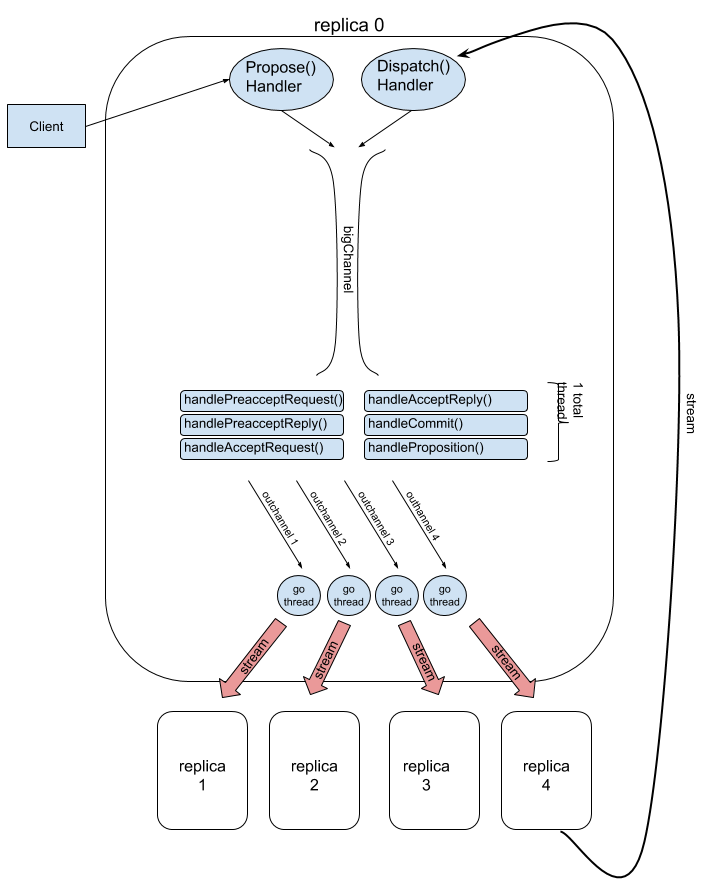

# Project 4: Epaxos
**Part A Due: Nov 4, 2018, 11:59:59 pm, v1**

## Setup

Goals:
1. Correct, executing epaxos w/ K/V functionality
2. Efficient and correct (wrt synchronization) log(s) maintainence.
4. Communication efficiency: thriftiness, batching. : 

Non-Goals:
1. Garbage collection, long-lived replicas.
1. Fault tolerance and recovery.

This project will be diviced into three parts:
- comm structure (two weeks)
- log structure  (one week)
- execution, batching, KV  (one week)


## Setup
Download files from **here**.
The provided files establish a basic directory structure, and provide
a complete implementation of the client, together with the protocol buffer and service
definitions, all in a single file.

- `config.json` : defines replica endpoints and nothing else
- `client/client.go`: complete implementation of the client.go
- `pb/comm.proto`: complete description of messages and services. **Do not modify**
  existing definitions, though you may add messages/services for testing etc.
- `pb/comm.pb.go`: complete compilation of the above.
- `replica/replica.go`: skeleton of a replica. Put all replica code
  in this file.
- `replica/run.rb`: starts up multiple replicas at once. Kill them with `killall replica`.

## Part 1: Communicating Processes

For this part you will build the entire communication infrastructure for the
project. Clients  communicate with replicas via unary (non-streaming) gRPC calls. For this
you will need
[gRPC)(https://grpc.io/docs/quickstart/go.html) and [here](https://grpc.io/docs/tutorials/basic/go.html),
and get to know the [concepts](https://grpc.io/docs/guides/concepts.html) page. The latter
discusses the difference between *unary* and *streaming* RPCs. You will be using both. For
the latter you will be using *bi-directional* streaming.


### Client
The client is pre-built for you, and communicates with replicas via unary RPC. The client
can either send all requests to the first replica listed in `config.json`, or round-robin to all replicas. 

There may be many concurrent client proposals outstanding at any given time, but the
`bigDispatcher()` must return the reply to the correct client request thread  (gRPC allows
each request to be handled by distinct threads).  We handle this as follows:
- each client request handler creates a new channel and passes through `bigChannel` along
with the actual proposal.
- `bigChannel`'s proposal handler must stash this channel where it can be found when the
protocol commits the message.
- the channel is part of the `MsgContainer` structure.
- client requests each contain a unique "identity" string...

## Replica

The general architecture of your replica is shown below for a five-replica system. Though
the code works perfectly well for multiple clients, you only need to test with a single client.



Each replica accepts unary requests from the single client via the `Propose()` handler,
and from other replicas via the `Dispatch()` handler. Despite the asynchronous,
multi-threaded nature of the gRPC interface, we are going to structure the replica as a
single-threaded event handler reading messages one-at-a-time from `bigChannel`.

This single-threaded approach has the advantage of reducing synchronization requirements
and making debugging much simpler.
Note that messages from both other replicas and from the client are all shoved down this
single large channel.

All messages to replica *i* are serialized by pushing through `outchannels[i]`. The other
end of `outchannels[i]` is a single go thread that reads from the `outchannel` and writes
to a bi-directional stream to that other replica.

### Two Bi-Directional Streams, But Only Two Streams of Data
Each replica *dials* each other replica and creates a bi-directional stream. This gives us
a total of four streams between each replica pair, but **we only use two**. Messages sent
*to* another replica go through `outchannels` to one end of the stream created by
*dial*ing the other replica. Messages *from* the other replica come in through
`Dispatch()` and get pushed into `bigChannel`.

## Project 4a
For this part of the project you need to get all messages working, even though the data in
the messages is nulled out. To be more clear, when a proposal is sent from the client, a
replica should:
- receive it in the proper handler, wrap it in a `MsgContainer`, and push down
`bigChannel`.
- it should then be read from `bigChannel` and cause `PreacceptRequest` messages to be sent.
- `PreacceptRequest` messages should be read at the other replicas, and `PreacceptReply` messages
should be sent in return.
- Once a quorum of replies has been collected, all other replicas should be sent
`CommitRequest` messages, and a reply should be sent to the **correct** client.

Other than the correct type of messages being sent, and to a correct
set of replicas, the content of the messages is irrelevant. 
## Testing
I will be testing by observing debugging messages showing each message sent and received,
and by looking at the contents of `metrics`.

## Tiny Notes (more will be added as I think of them)
- You should use the same directory structure as in previous projects.

## Due Dates
- **Part A**:  **Nov 4, 2018, 11:59:59 pm**
- **Part B**:  Nov 11, 2018, 11:59:59 pm
- **Part C**:  Nov 18, 2018, 11:59:59 pm

Submit by emailing me a tarball of
`~/go/src/818fall18/keleher/p4/partA`, for example, with the tarball
appropriately defining you (as `p4Akeleher.tgz`, for example).

To create the tarball, for example:
```
  cd ~/go/src/818fall18/keleher/p4
  tar cvfz p4Akeleher.tgz partA 
  ```
  
