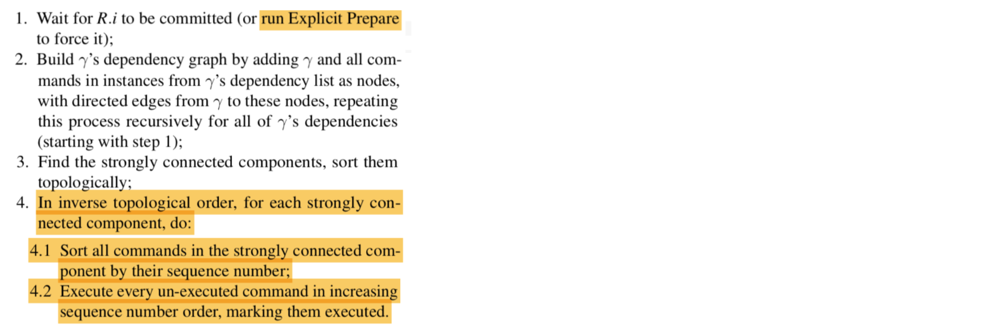

# Project 4: Epaxos
**Part B Due: Dec 9, 2018, 11:59:59 pm, v1**

## Setup

Goals:
For this part of the project you implement the meat of the protocol. You do *not* need to
implement *recovery*.
You *do* need to implement pretty much everything else, including:
1. thrifty consensus
   - should be implemented to include the *next* necessary replicas.  For
     example, in a 5-replica system, replica 3's *next* two replicas are 4 and 0.
1. actually building the 2-d log, populating it accurately.
1. both fast and slow paths, based on dependences returned by PREACCEPT replies. This implies:
  - accurate counting of PREACCEPT and ACCEPT acknowledgements, with full
    concurrency. In other words, you can not assume there is only a single
    operation with outstanding RPCs at a time.
  - accurate detection of conflicts, dependency tracking
1. operation execution, which means applying operations
  - op execution can only take place when all prior dependencies have been
    satisfied (the op executed)
1. in-memory, non-durable key-value store

Non-Goals:
1. Garbage collection, long-lived replicas.
1. Fault tolerance and recovery.

## Setup
Download files <a href="https://kelehers.me/818/projects/all.mov">here</a>.
The provided files establish a basic directory structure, and provide
a complete implementation of the client, together with the protocol buffer and service
definitions, all in a single file.

- `config.json` : defines replica endpoints and nothing else
- `client/client.go`: complete implementation of the client.go
- `pb/comm.proto`: complete description of messages and services. **Do not modify**
  existing definitions, though you may add messages/services for testing etc.
- `pb/comm.pb.go`: complete compilation of the above.
- `replica/replica.go`: skeleton of a replica. Put all replica code
  in this file.
- `replica/run.rb`: starts up multiple replicas at once. Kill them with `killall replica`.

	

## Log Writes

Your system must fully track and commit accesses across all replicas, w/ commits
eventually bringing all replicas up to date.  This means that all operations must end up
consistently replicated across all replicas.

## Batching
Your system should, with the appropriate command-line argument, batch
multiple client *proposals* into a single instance to be committed. A
few notes:
- Do this in `bigDispatcher()`.
- ... which should now use a `select` clause to remove one event from
  either `bigChan` or the ticker you will use to drive periodic
  execution of `executeSome()` (see below).
- Aggregate by, after reading a client proposal from `bigChan`,
  continuing to read more events from `bigChan` until one of them is
  not a client proposal (save this and work on it immediately after you
  finish sending out the batched proposals.
- If no items are left in `bigChan` it would ordinarily block. Prevent
  this by adding a "default:" clause to the select statement. It need
  not do anything.

## KV Store

Your system must include a full, non-durable key-value store that implements the service
defined in `pb/client.proto`. This means that your store should implement *Put*, *Get*,
and *Del*. *Get* should return an appropriate value to the client.

## Dependency and Conflict Tracking

New operations must be assigned a set of *dependencies*. The dependencies of a given
operation are defined as the nearest
conflicting operations known at the time the operation is handled in `bigDispatcher`.
PREACCEPT and COMMIT messages make these dependencies known to other
replicas. PREACCEPTREPLY's potentially modify the set of dependencies known to the leader,
potentially requiring the *slow path* to be executed before commits can be sent.

## Operation Execution
	
Write operations must be *executed*, i.e. applied to the object store, before the value
written can be returned as the result of a read. The paper describes operation execution
in the pseudo-code below. In our system, execution is implemented by `executeSome()`. This method builds the set of unexecuted operations in the 2-D log, and then uses
the below procedure to order the operations for potential execution. Note that if the set
contains an operation that is not yet marked as committed locally, `executeSome()` can not
complete. Instead, it returns immediately, abandoning any work it has done. When next
restarting, restarts the algorithm resets to the beginning.

`executeSome()` is run in response to 1) reads committing, and at 2) periodic intervals
delimited by a *ticker* (which should default to 2 milliseconds). `bigDispatcher` should
now read from either **bigChan** *or* the ticker, using a `select` call.
`executeSome()` should return an ordered array of SCCs, each consisting of an ordered
sequence of the SCC's instructions.

Note that **Instances** have two distinct types of ordering imformation: the *sequence*
number and the *deps*. The latter is used to find strongly connected components. The
former is used order instructions within SCCs, and to order SCCS.

### New command-line arguments and behaviors for both the `client` and the `replica`.
 
The repository contains new versions of many of the files. The protocol used between the
client and the replica has changed. Your replica will now respond to two services instead
of one. This is easily handled by just registering two servers instead of one. The other
calls (listening, reflection, `.serve()`, etc.) do not have to be duplicated.

### Notes

- The first log entry should be 0.

### Testing 

The ground truth is that you need to make your system emit the same lines of text as mine
does in the video soon-to-be-linked <a
href="https://kelehers.me/818/projects/all.mov">here</a>. 

**Changes to debug flag use:**
- `debug` is now an integer, defaulting to 0.
- `p_out` prints if debug at 9 or higher.
- `p_err` always prints
- `p_level(l)` prints if level at or above 'l'. l=9 is equivalent to the `-d` from before.

**Your p_out's should be replaced with p_level's**, with the following levels (see the recording for details):
     
     l=1 	     single line per message send, w/ type and dest
     l=2	     as above, but including dep's, and seq, if applicable.
     
Grading:
1. code review (30%): I will make sure your code is doing what I ask without shortcuts

1. correct operation 5 reps, a write sent to 0 followed, by a conflicting write being sent
to 3. I just want to see correct, *thrifty* messaging.
        
        CLIENT
        go run client.go -N 5 -a 0,w,k,v
        go run client.go -N 5 -a 3,w,k,v
        
        REPLICAS
        hub:~/dss/epaxos/solution/replica> ./run.rb 5 -d 1
        go run replica.go -N 5 -r 0 -d 1&
        go run replica.go -N 5 -r 1 -d 1&
        go run replica.go -N 5 -r 2 -d 1&
        go run replica.go -N 5 -r 3 -d 1&
        go run replica.go -N 5 -r 4 -d 1&
        hub:~/dss/epaxos/solution/replica> 2:Ready... rep 2, port "9003", N=5, exec=true, pause=false, agg=false, reps:[3 4]
        3:Ready... rep 3, port "9004", N=5, exec=true, pause=false, agg=false, reps:[4 0]
        1:Ready... rep 1, port "9002", N=5, exec=true, pause=false, agg=false, reps:[2 3]
        0:Ready... rep 0, port "9001", N=5, exec=true, pause=false, agg=false, reps:[1 2]
        4:Ready... rep 4, port "9005", N=5, exec=true, pause=false, agg=false, reps:[0 1]
        0:Sending msg "PREACCEPT" to 2
        0:Sending msg "PREACCEPT" to 1
        2:Sending msg "PREACCEPTREPLY" to 0
        1:Sending msg "PREACCEPTREPLY" to 0
        0:Sending msg "COMMIT" to 4
        0:Sending msg "COMMIT" to 1
        0:Sending msg "COMMIT" to 2
        0:Sending msg "COMMIT" to 3
        3:Sending msg "PREACCEPT" to 0
        3:Sending msg "PREACCEPT" to 4
        4:Sending msg "PREACCEPTREPLY" to 3
        0:Sending msg "PREACCEPTREPLY" to 3
        3:Sending msg "COMMIT" to 4
        3:Sending msg "COMMIT" to 0
        3:Sending msg "COMMIT" to 1
        3:Sending msg "COMMIT" to 2
1. as above, but I will turn on the
   replica's *pause* flag (see below). This delays commits by ten seconds, allowing me to
   guarantee that the slow path will be necessary.
        
        CLIENT
        go run client.go -N 5 -a 0,w,k,v
        go run client.go -N 5 -a 3,w,k,v
        
        REPLICAS
        hub:~/dss/epaxos/solution/replica> ./run.rb 5 -d 1 -p
        go run replica.go -N 5 -r 0 -d 1 -p&
        go run replica.go -N 5 -r 1 -d 1 -p&
        go run replica.go -N 5 -r 2 -d 1 -p&
        go run replica.go -N 5 -r 3 -d 1 -p&
        go run replica.go -N 5 -r 4 -d 1 -p&
        hub:~/dss/epaxos/solution/replica> 0:Ready... rep 0, port "9001", N=5, exec=true, pause=true, agg=false, reps:[1 2]
        4:Ready... rep 4, port "9005", N=5, exec=true, pause=true, agg=false, reps:[0 1]
        1:Ready... rep 1, port "9002", N=5, exec=true, pause=true, agg=false, reps:[2 3]
        3:Ready... rep 3, port "9004", N=5, exec=true, pause=true, agg=false, reps:[4 0]
        2:Ready... rep 2, port "9003", N=5, exec=true, pause=true, agg=false, reps:[3 4]
        0:Sending msg "PREACCEPT" to 2
        0:Sending msg "PREACCEPT" to 1
        1:Sending msg "PREACCEPTREPLY" to 0
        2:Sending msg "PREACCEPTREPLY" to 0
        3:Sending msg "PREACCEPT" to 0
        3:Sending msg "PREACCEPT" to 4
        0:Sending msg "PREACCEPTREPLY" to 3
        4:Sending msg "PREACCEPTREPLY" to 3
        3:Sending msg "ACCEPT" to 0
        3:Sending msg "ACCEPT" to 4
        0:Sending msg "ACCEPTREPLY" to 3
        4:Sending msg "ACCEPTREPLY" to 3
        0:Sending msg "COMMIT" to 4
        0:Sending msg "COMMIT" to 2
        0:Sending msg "COMMIT" to 3
        0:Sending msg "COMMIT" to 1
        3:Sending msg "COMMIT" to 0
        3:Sending msg "COMMIT" to 4
        3:Sending msg "COMMIT" to 1
        3:Sending msg "COMMIT" to 2
1. as above, but I also want to see `Deps` and `seq` numbers on preaccept and accept messages.
        
        CLIENT
        go run client.go -N 5 -a 0,w,k,v
        go run client.go -N 5 -a 3,w,k,v
        
        REPLICAS
        hub:~/dss/epaxos/solution/replica> ./run.rb 5 -d 2 -p
        go run replica.go -N 5 -r 0 -d 2 -p&
        go run replica.go -N 5 -r 1 -d 2 -p&
        go run replica.go -N 5 -r 2 -d 2 -p&
        go run replica.go -N 5 -r 3 -d 2 -p&
        go run replica.go -N 5 -r 4 -d 2 -p&
        hub:~/dss/epaxos/solution/replica> 0:Ready... rep 0, port "9001", N=5, exec=true, pause=true, agg=false, reps:[1 2]
        4:Ready... rep 4, port "9005", N=5, exec=true, pause=true, agg=false, reps:[0 1]
        1:Ready... rep 1, port "9002", N=5, exec=true, pause=true, agg=false, reps:[2 3]
        2:Ready... rep 2, port "9003", N=5, exec=true, pause=true, agg=false, reps:[3 4]
        3:Ready... rep 3, port "9004", N=5, exec=true, pause=true, agg=false, reps:[4 0]
        0:preaccept deps: [-1 -1 -1 -1 -1], seq 1
        0:Sending msg "PREACCEPT" to 2
        0:Sending msg "PREACCEPT" to 1
        1:preacceptReply deps: [-1 -1 -1 -1 -1], seq 1
        2:preacceptReply deps: [-1 -1 -1 -1 -1], seq 1
        1:Sending msg "PREACCEPTREPLY" to 0
        2:Sending msg "PREACCEPTREPLY" to 0
        3:preaccept deps: [-1 -1 -1 -1 -1], seq 1
        3:Sending msg "PREACCEPT" to 0
        3:Sending msg "PREACCEPT" to 4
        0:preacceptReply deps: [0 -1 -1 -1 -1], seq 2
        0:Sending msg "PREACCEPTREPLY" to 3
        4:preacceptReply deps: [-1 -1 -1 -1 -1], seq 1
        4:Sending msg "PREACCEPTREPLY" to 3
        3:accept deps: [0 -1 -1 -1 -1], seq 2
        3:Sending msg "ACCEPT" to 0
        3:Sending msg "ACCEPT" to 4
        0:replyAccept deps: [0 -1 -1 -1 -1], seq 2
        0:Sending msg "ACCEPTREPLY" to 3
        4:replyAccept deps: [0 -1 -1 -1 -1], seq 2
        4:Sending msg "ACCEPTREPLY" to 3
        0:Sending msg "COMMIT" to 2
        0:Sending msg "COMMIT" to 3
        0:Sending msg "COMMIT" to 4
        0:Sending msg "COMMIT" to 1
        3:Sending msg "COMMIT" to 0
        3:Sending msg "COMMIT" to 4
        3:Sending msg "COMMIT" to 2
        3:Sending msg "COMMIT" to 1
1. Testing of your execute procedure. Three tests are defined in `tarjan_test.go`. I will
run them with `go test`, and the output should be:
        
        hub:~/dss/epaxos/solution/replica> go test
        0:
        one: 
        scc {
        	r 0/sl 0/se 0/st 4 "text" [-1 -1 -1 -1 0]
        	r 4/sl 0/se 0/st 4 "text" [0 -1 -1 -1 -1]
        }
        scc {
        	r 0/sl 1/se 1/st 4 "text" [-1 -1 -1 -1 1]
        	r 4/sl 1/se 1/st 4 "text" [1 -1 -1 -1 -1]
        }
        
        0:
        two: 
        scc {
        	r 0/sl 0/se 0/st 4 "text" [-1 -1 0 -1 -1]
        	r 1/sl 0/se 0/st 4 "text" [0 -1 -1 -1 -1]
        	r 2/sl 0/se 0/st 4 "text" [-1 0 -1 -1 -1]
        }
        scc {
        	r 3/sl 0/se 0/st 4 "text" [0 -1 -1 -1 -1]
        }
        
        0:
        three: 
        scc {
        	r 1/sl 0/se 0/st 4 "text" [-1 -1 -1 -1 -1]
        }
        scc {
        	r 2/sl 0/se 0/st 4 "text" [-1 -1 -1 -1 -1]
        }
        scc {
        	r 0/sl 0/se 1/st 4 "text" [-1 0 -1 -1 -1]
        }
        scc {
        	r 1/sl 1/se 2/st 4 "text" [0 0 -1 -1 -1]
        }
        scc {
        	r 1/sl 2/se 3/st 4 "text" [-1 1 0 -1 -1]
        }
        scc {
        	r 2/sl 1/se 4/st 4 "text" [0 2 0 -1 -1]
        }
        
        PASS
        ok  	dss/epaxos/solution/replica	0.056s
1. I will test your data store by writing into it, such as with `go run client.go -N 3 -d -a 0,r,nice,55`,
followed by `go run client.go -N 3 -d -a 2,r,nice,`. I should be able
to read the value of "nice" as follows:
        
        ./run.rb 3 -d 0
        
           and
        
        hub:~/dss/epaxos/solution/client> go run client.go -N 3 -d -a 0,w,nice,55
        wrote "nice": "55" to 0
        hub:~/dss/epaxos/solution/client> go run client.go -N 3 -d -a 2,r,nice,
        read "nice": "55" from 2

        
1. The above will give you points merely by returning whatever value is in the KV
   store. For this 10 pts you must return the correct value. 
        
        CLIENT
        go run client.go -N 3 -d -a 0,w,nice,55
        sleep 1
        go run client.go -N 3 -d -a 0,w,nice,88
        go run client.go -N 3 -d -a 2,r,nice,
        sleep 6
        go run client.go -N 3 -d -a 2,r,nice,
        sleep 6
        go run client.go -N 3 -d -a 2,r,nice,
        
        REPLICAS
        ./run.rb 3 -p -d 0

### Submission

1. Your code must conform to a new directory hierarchy. It must all assume it lives in
`$GOPATH/src/818e/p4b/<your dirid>`. It must be in a file called `<your dirid>.tgz`. Create
this as follows:

        cd ~/go/src/818e/p4b; tar cvfz <your dirid>.tgz <your dirid>

1. Submit to <a href="https://umd.instructure.com/courses/1247011/assignments/4761130">ELMS</a>.

